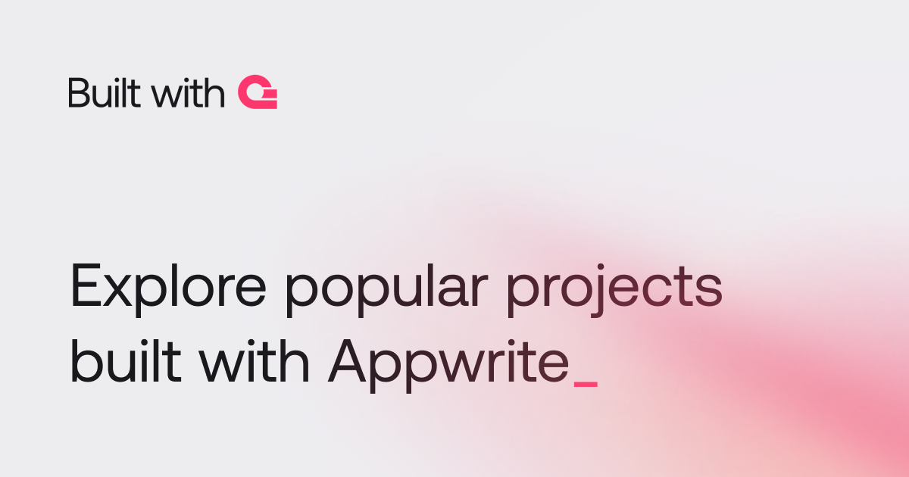
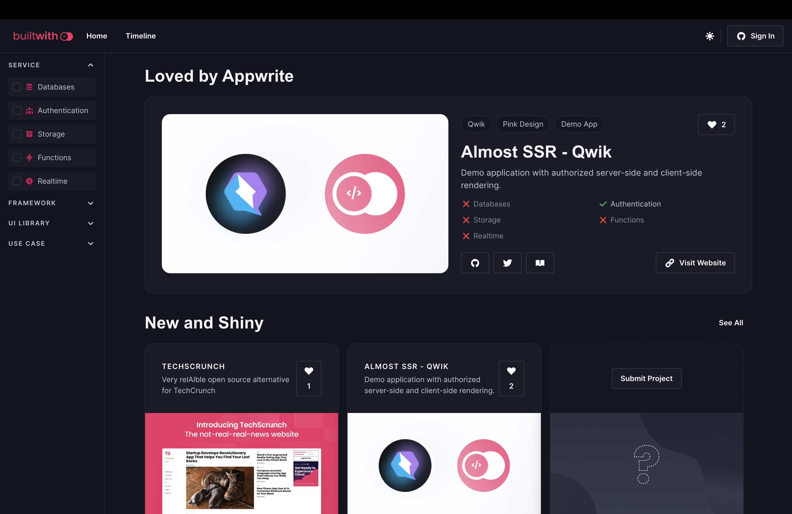
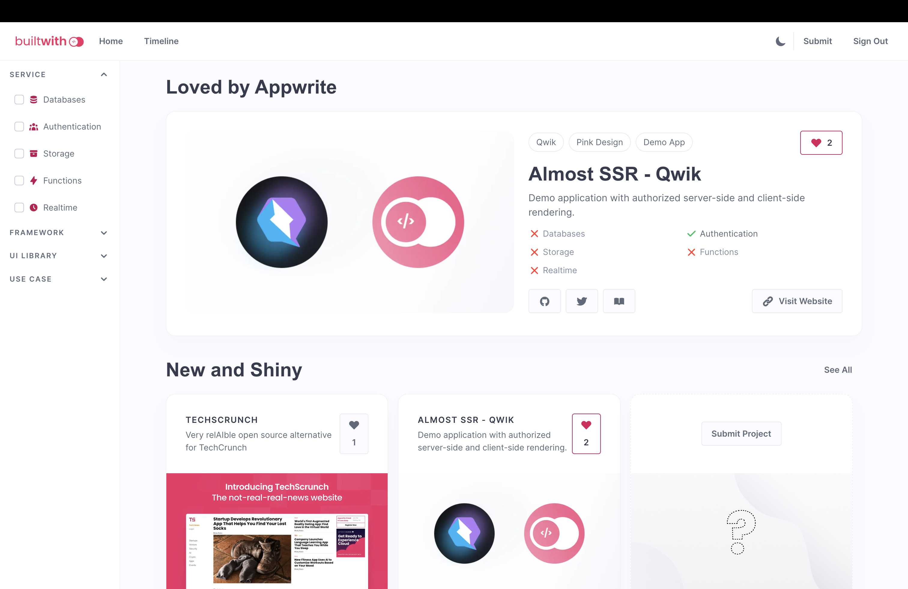
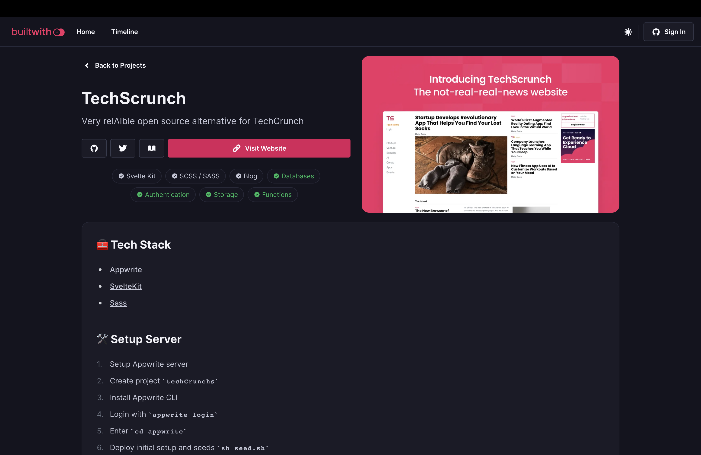
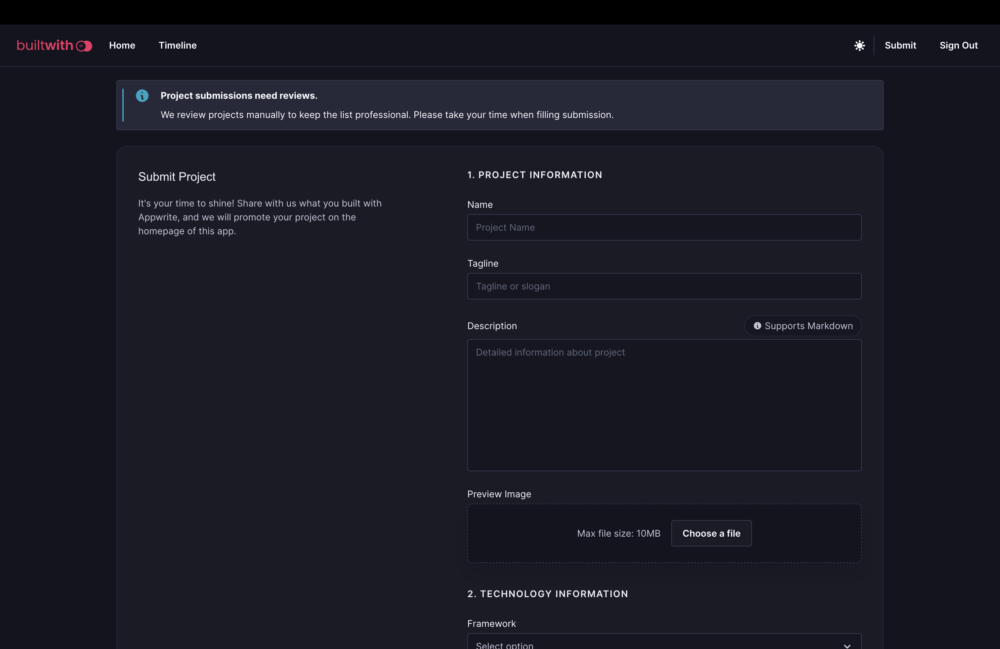

# 🙌 Built with Appwrite

> Explore popular projects built with Appwrite.

## 🧰 Tech Stack

- [Appwrite](https://appwrite.io/)
- [Qwik](https://qwik.builder.io/)
- [Pink Design](https://pink.appwrite.io/)
- [Node.JS](https://nodejs.org/)
- [TypeScript](https://www.typescriptlang.org/)

## 🛠️ Setup Server

1. Register [Appwrite](https://cloud.appwrite.io/) account
2. Create project
3. Install Appwrite CLI
4. Login with `appwrite login`
5. Update project ID in `appwrite.json`
6. Deploy database structure with `appwrite deploy collection`
7. Deploy storage structure with `appwrite deploy bucket`
8. Deploy functions with `appwrite deploy function`
9. Set variables on deployed functions. Functions can be found in `functions` folder. They all have `README.md` describing what variables they need
10. Setup `GitHub` OAuth provider

## 👀 Client Setup

1. Install libraries `npm install`
2. Update projectID or endpoint in `src/AppwriteService.ts`, if not using production
3. Start server `npm run dev`

## 🚨 Moderation

Give moderators access to Appwrite Console. When project is good for publication, update `isPublished` to `true` and save document.

## 🚀 Deploy

1. Deploy frontend on root domain such as `myapp.com`
2. Add custom subdomain to Appwrite Project, such as `appwrite.myapp.com`
3. Add frontend domain as a platform in Appwrite project

## 🤝 Contributing

To contribute to frontend, make sure to use the [Pink Design](https://pink.appwrite.io/) design system. For state management, features of [Qwik](https://qwik.builder.io/) should be used. All logic related to communication with backend should be kept in `src/AppwriteService.ts`.

When contributing to Appwrite Functions, use [Appwrite CLI](https://appwrite.io/docs/command-line). Also use Appwrite CLI to sync changes to project structure such as databases, collections or buckets.

## 🖼️ Screenshots






## 🤖 Auto-generated documentation

## Qwik City App ⚡️

- [Qwik Docs](https://qwik.builder.io/)
- [Discord](https://qwik.builder.io/chat)
- [Qwik GitHub](https://github.com/BuilderIO/qwik)
- [@QwikDev](https://twitter.com/QwikDev)
- [Vite](https://vitejs.dev/)

---

## Project Structure

This project is using Qwik with [QwikCity](https://qwik.builder.io/qwikcity/overview/). QwikCity is just an extra set of tools on top of Qwik to make it easier to build a full site, including directory-based routing, layouts, and more.

Inside your project, you'll see the following directory structure:

```
├── public/
│   └── ...
└── src/
    ├── components/
    │   └── ...
    └── routes/
        └── ...
```

- `src/routes`: Provides the directory based routing, which can include a hierarchy of `layout.tsx` layout files, and an `index.tsx` file as the page. Additionally, `index.ts` files are endpoints. Please see the [routing docs](https://qwik.builder.io/qwikcity/routing/overview/) for more info.

- `src/components`: Recommended directory for components.

- `public`: Any static assets, like images, can be placed in the public directory. Please see the [Vite public directory](https://vitejs.dev/guide/assets.html#the-public-directory) for more info.

## Add Integrations and deployment

Use the `npm run qwik add` command to add additional integrations. Some examples of integrations include: Cloudflare, Netlify or Express server, and the [Static Site Generator (SSG)](https://qwik.builder.io/qwikcity/guides/static-site-generation/).

```shell
npm run qwik add # or `yarn qwik add`
```

## Development

Development mode uses [Vite's development server](https://vitejs.dev/). During development, the `dev` command will server-side render (SSR) the output.

```shell
npm start # or `yarn start`
```

> Note: during dev mode, Vite may request a significant number of `.js` files. This does not represent a Qwik production build.

## Preview

The preview command will create a production build of the client modules, a production build of `src/entry.preview.tsx`, and run a local server. The preview server is only for convenience to locally preview a production build, and it should not be used as a production server.

```shell
npm run preview # or `yarn preview`
```

## Production

The production build will generate client and server modules by running both client and server build commands. Additionally, the build command will use Typescript to run a type check on the source code.

```shell
npm run build # or `yarn build`
```

## Vercel Edge

This starter site is configured to deploy to [Vercel Edge Functions](https://vercel.com/docs/concepts/functions/edge-functions), which means it will be rendered at an edge location near to your users.

## Installation

The adaptor will add a new `vite.config.ts` within the `adapters/` directory, and a new entry file will be created, such as:

```
└── adapters/
    └── vercel-edge/
        └── vite.config.ts
└── src/
    └── entry.vercel-edge.tsx
```

Additionally, within the `package.json`, the `build.server` script will be updated with the Vercel Edge build.

## Production build

To build the application for production, use the `build` command, this command will automatically run `npm run build.server` and `npm run build.client`:

```shell
npm run build
```

[Read the full guide here](https://github.com/BuilderIO/qwik/blob/main/starters/adapters/vercel-edge/README.md)

## Dev deploy

To deploy the application for development:

```shell
npm run deploy
```

Notice that you might need a [Vercel account](https://docs.Vercel.com/get-started/) in order to complete this step!

## Production deploy

The project is ready to be deployed to Vercel. However, you will need to create a git repository and push the code to it.

You can [deploy your site to Vercel](https://vercel.com/docs/concepts/deployments/overview) either via a Git provider integration or through the Vercel CLI
