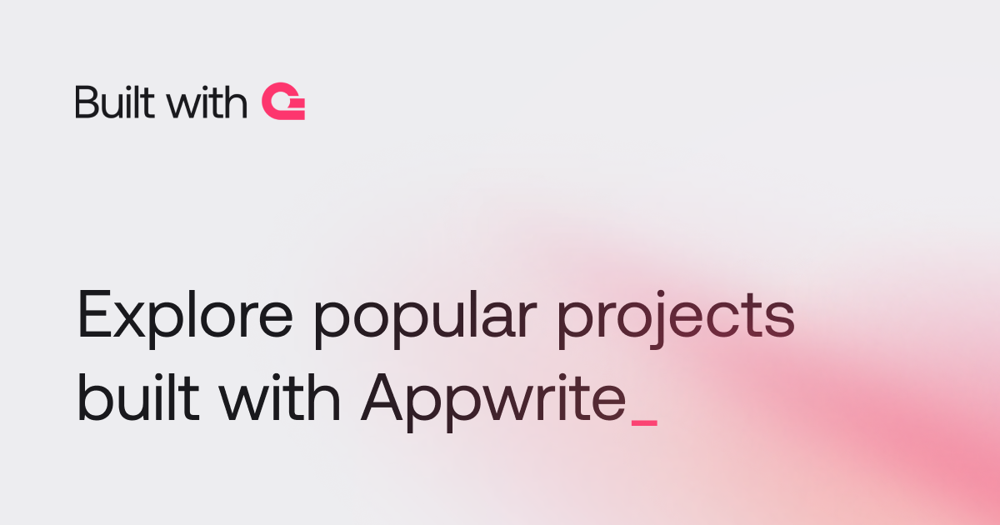
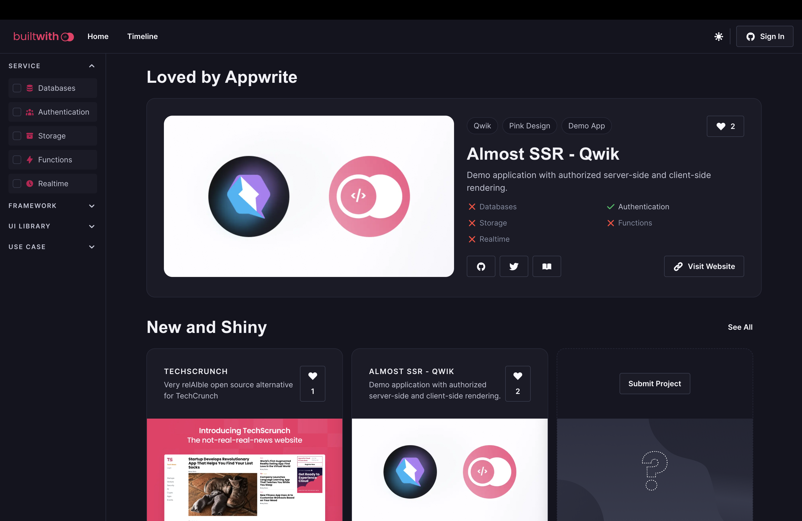
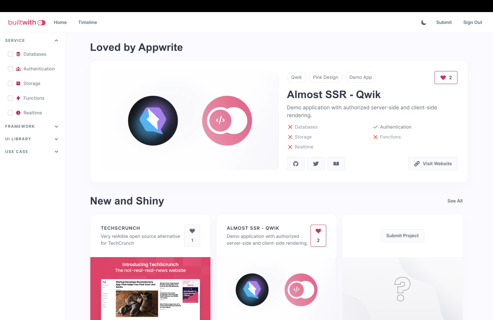
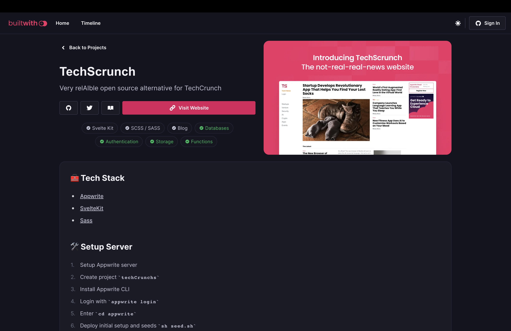
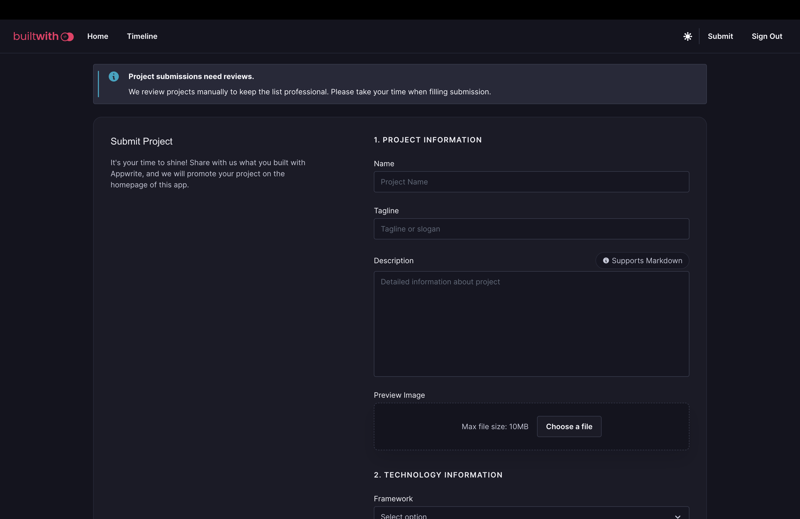

# 🙌 Built with Appwrite

> Explore popular projects built with Appwrite — live at [builtwith.appwrite.network](https://builtwith.appwrite.network/).

The frontend is a Next.js 14 (App Router) site that runs on **Appwrite Sites SSR**. Server components fetch projects directly from Appwrite via `node-appwrite`, so every URL — including dynamic project pages — is server-rendered on demand. Theme, account state, upvoting, and the ⌘K search live on the client.

## 🧰 Tech Stack

- [Appwrite Cloud](https://cloud.appwrite.io/) — database, auth, storage, functions, and hosting via [Appwrite Sites](https://appwrite.io/docs/products/sites)
- [Next.js 14](https://nextjs.org/) — App Router, React Server Components, SSR
- [Pink Design](https://pink.appwrite.io/) — Appwrite's design system
- [TypeScript](https://www.typescriptlang.org/) + [marked](https://marked.js.org/) + [xss](https://github.com/leizongmin/js-xss)

## 🛠️ Backend setup (one-time)

1. Sign up for [Appwrite Cloud](https://cloud.appwrite.io/) and create a project.
2. Install the [Appwrite CLI](https://appwrite.io/docs/command-line) and `appwrite login`.
3. Update `projectId` in `appwrite.json` to match your project.
4. Push the database, storage, and function definitions:
   ```bash
   appwrite push collection
   appwrite push bucket
   appwrite push function
   ```
5. Set the env vars on each function (each `functions/<id>/README.md` lists what it needs — typically just `APPWRITE_FUNCTION_API_KEY`).
6. Enable the **GitHub OAuth** provider in the Appwrite console (used for sign-in).
7. Add the production domain (e.g. `builtwith.appwrite.network` or your custom domain) as a **Web platform** under project settings so the SDK passes CORS.

## 👀 Local development

```bash
npm install
npm run dev
```

The app expects to talk to the same Appwrite project the production site uses (`builtWithAppwrite`). Update `APPWRITE_ENDPOINT` and `APPWRITE_PROJECT_ID` in `src/lib/types.ts` if you're pointing at your own project.

Useful scripts:

| Command         | Purpose                                           |
| --------------- | ------------------------------------------------- |
| `npm run dev`   | Next.js dev server with HMR                       |
| `npm run build` | Production build (typecheck + page bundle)        |
| `npm start`     | Run the production build locally                  |

## 🚀 Deploy to Appwrite Sites

This repo ships with an `appwrite.config.json` describing the site (`framework: nextjs`, `adapter: ssr`, `outputDirectory: ./.next`, `path: ./`). Deploying is a single command:

```bash
appwrite push site
```

Each push uploads the repo, builds with `npm install && npm run build`, then runs the site on Appwrite Sites' Node.js SSR runtime. Useful follow-ups:

```bash
# List recent deployments
appwrite sites list-deployments --site-id builtwith

# Activate a specific deployment
appwrite sites update-site-deployment \
  --site-id builtwith --deployment-id <id>

# Bind a custom domain
appwrite proxy create-site-rule \
  --domain example.com --site-id builtwith
```

The functions (`upvoteProject`, `submitProject`, `rejectProject`) deploy through the same flow with `appwrite push function`. They run with `s-1vcpu-1gb` runtime spec / `s-2vcpu-2gb` build spec to keep cold starts short.

## 🚨 Moderation

New submissions land in the `projects` collection with `isPublished: false`. Moderators with console access flip `isPublished` to `true` to publish. The `rejectProject` function fires on `projects.documents.*.update` events and notifies the submitter when a project is rejected.

All read paths in `src/lib/appwrite-server.ts` enforce `Query.equal("isPublished", true)` server-side so unpublished drafts never render.

## 🗂️ Project structure

```
appwrite.config.json     # Appwrite Sites + CLI config (site, framework, adapter)
appwrite.json            # Database / storage / functions definitions
functions/               # Source for upvoteProject, submitProject, rejectProject
public/                  # Static assets, logos, manifest
src/
├── app/                 # Next.js App Router pages + route handlers
│   ├── layout.tsx       # Root layout: fonts, providers, themed shell
│   ├── page.tsx         # Home (featured / new / trending / use-case counts)
│   ├── search/          # Filtered project list driven by search params
│   ├── projects/[projectId]/  # Server-rendered project detail
│   └── submit-project/  # Submission form (sectioned, with thumbnail uploader)
├── components/          # Header, footer, sidebar, project cards, upvote,
│                        # toast, search modal, theme provider, etc.
└── lib/                 # Appwrite server SDK, web SDK, query helpers, types
```

A few patterns worth knowing before contributing:

- **Server vs client.** Server components render data via `ServerAppwrite` (`node-appwrite`). Client components use `ClientAppwrite` (browser SDK) for things that need the user's session: upvotes, submit, theme toggle, account state, search modal.
- **Theme.** `Providers` reads the `theme_buildwithappwrite` cookie SSR-side; if absent, the inline pre-hydration script in `app/layout.tsx` falls back to `prefers-color-scheme` so the page paints in the right colour on first paint.
- **Toasts.** Use `useToast()` from `src/components/toast.tsx` instead of `alert()`.
- **Sidebar containment.** `.main-side` and `.project-card-virtual` use CSS `contain` to keep scroll work cheap with many cards on screen.

## 🤝 Contributing

UI work uses [Pink Design](https://pink.appwrite.io/) tokens and components. Keep server data access in `src/lib/appwrite-server.ts` and client interactivity in `src/lib/appwrite-client.ts`. For database / storage / function changes, edit `appwrite.json` and push via the CLI rather than clicking through the console.

## 🖼️ Screenshots





